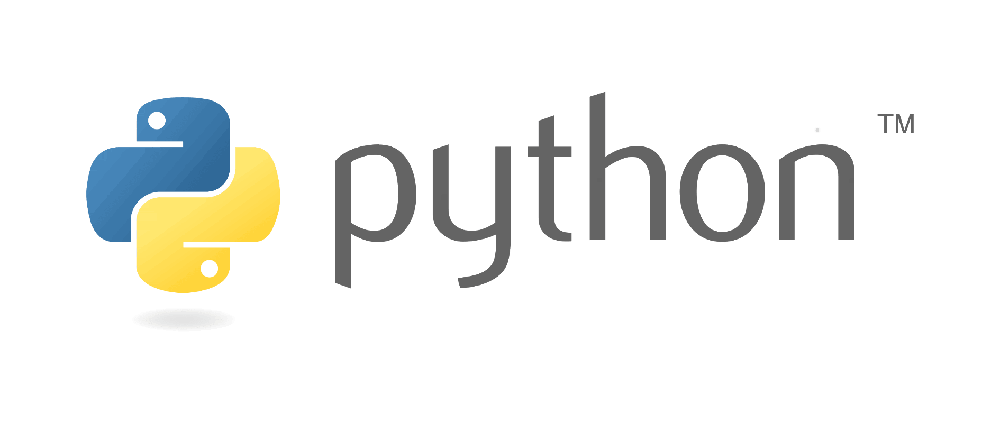

## Курс "Компьютерные технологии и моделирование биосистем" БиоХим ТА КФУ

В курсе рассматриваются основы программирования на языке Python. В качестве основной среды исполнения кода используется Jupyter Notebook и Google Colaboratory.

### Занятие 1. Настройка рабочего окружения. Введение в Python

- [Организационные вопросы](./lesson1/lesson1.1.md)
- О языке программирования Python
- Варианты разработки программ
- Установка чистого интерпретатора Python
- Установка Anaconda и знакомство с интерпретатором Python
- Знакомство с Jupyter Notebook
- Знакомство с Google Colaboratory
- О языке разметки Markdown
- Типы объектов языка Python
- Основные арифметические операторы
- Строки
- Логические тип данных. Логические операторы. Операторы ветвления.
- Организация циклических вычислений
- Практика решения простейших задач
- Полезные ссылки

  

