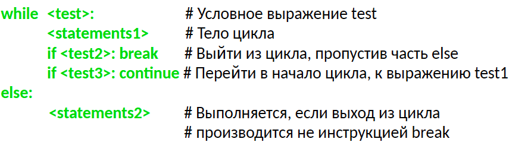
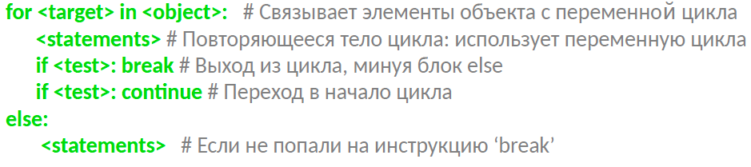

## Организация циклических вычислений

### Цикл While 

Цикл While очень удобен, потому что он позволяет Вашей программе работать, пока Вы не решите её остановить. Эта конструкция позволяет организовать бесконечный цикл, который ждет действий пользователя.

### Что такое цикл while?

Цикл while проверяет начальные условия. Если условие выполняется, цикл начинает работать. Каждый раз когда проходит одна итерация, условие проверяется снова. До тех пор, пока условие выполняется, цикл продолжает работать. Как только условие перестает выполняться, цикл заканчивает свою работу.

### Общий синтаксис



```
# Python 2 and 3 compatibility
# pip install future
from __future__ import (absolute_import, division,
                        print_function, unicode_literals)
from builtins import *
```

```
# Некоторое начальное условие
game_active = True

lives = 3
# Сам цикл while 
while game_active:
    # Запускаем игру.
    # В какой-то момент времени необходимо изменить значение game_active на False.
    # Когда это случится, цикл закончит свою работу
    if lives == 0:
        print("Game Over!")
        break
    
# Действия по окончанию цикла
```

- Каждый цикл должен иметь начальное условие которое выполняется
- Ключевое слово `while` включает в себя проверяемое условие
- Код внутри цикла выполняется до тех пор, пока верно начальное условие
- Как только что-то меняется и начальное условие не выполняется, цикл перестает выполняться
- По окончании цикла выполняется код, написанный далее

## Пример

В примере игра, которая продолжается до тех пор, пока у игрока есть силы

```
# Установим силы игрока - 5.
power = 5

# Играть можно пока сил не станет - 0.
while power > 0:
    print("You are still playing because your power is %d." % power)
    # игра начинается тут: 
    #   возможная потеря сил
    # Допустим, с каждым разом сила у Люка уменьшается на 1
    power = power - 1
else:    
    print("\nOh no, your power dropped to 0! Game Over.")
```

## Python 2.7

В Python 3 Вы всегда используете `input()`, и метод возвращает строку. В Python 2.7 `input()` - для ввода чисел, а для строк используйте `raw_input()`:

```
# Список содержит несколько имен
names = ['guido', 'tim', 'jesse']

# Просим пользователя ввести имя
new_name = input("Please tell me someone I should know: ")

# Добавим новое имя в список
names.append(new_name)

# Напечатаем список, чтобы показать, что имя было добавлено
print(names)
```

Использовать `input()` надо аккуратно, поскольку пользователь по сути может ввести что угодно.

# Другое применение цикла while

Большинство программ работают до тех пор, пока вы не завершите работу, введя quit, exit ...etc. Рассмотрим пример организации цикла для подобного рода поведения:

```
# Создадим список
names = []

# Определим переменную new_name отличную от 'quit'.
new_name = ''

# Начнем цикл, который будет выполняться до тех пор, пока не набрано 'quit'.
while new_name != 'quit':
    # Попросим пользователя ввести имя
    new_name = input("Please tell me someone I should know or enter 'quit': ")

    # Добавим это имя в список который был создан ранее
    names.append(new_name)

# Покажем что все, что было набрано - добавлено в наш список.
print(names)
```

Все хорошо, но! - 'quit' добавилось в лист. Давайте добавим `if` чтобы убрать этот баг:

```
#Ничего нового
names = []

new_name = ''

while new_name != 'quit':
    new_name = input("Please tell me someone I should know, or enter 'quit': ")
    names.append(new_name)
    
del names[-1]
        
print(names)
```

Теперь у нас есть способ организации ввода для пользователя и контроля времени выполнения программы.

# Использование цикла while для создания меню

```
# Give the user some context.
print("\nWelcome to the nature center. What would you like to do?")

# Set an initial value for choice other than the value for 'quit'.
choice = ''

# Start a loop that runs until the user enters the value for 'quit'.
while choice != 'q':
    # Give all the choices in a series of print statements.
    print("\n[1] Enter 1 to take a bicycle ride.")
    print("[2] Enter 2 to go for a run.")
    print("[3] Enter 3 to climb a mountain.")
    print("[q] Enter q to quit.")
    
    # Ask for the user's choice.
    choice = input("\nWhat would you like to do? ")
    
    # Respond to the user's choice.
    if choice == '1':
        print("\nHere's a bicycle. Have fun!\n")
    elif choice == '2':
        print("\nHere are some running shoes. Run fast!\n")
    elif choice == '3':
        print("\nHere's a map. Can you leave a trip plan for us?\n")
    elif choice == 'q':
        print("\nThanks for playing. See you later.\n")
    else:
        print("\nI don't understand that choice, please try again.\n")
        
# Print a message that we are all finished.
print("Thanks again, bye now.")
```

Ещё одно меню, но немного симпатичного кода

```
# Define the actions for each choice we want to offer.
def ride_bicycle():
    print("\nHere's a bicycle. Have fun!\n")
    
def go_running():
    print("\nHere are some running shoes. Run fast!\n")
    
def climb_mountain():
    print("\nHere's a map. Can you leave a trip plan for us?\n")

# Give the user some context.
print("\nWelcome to the nature center. What would you like to do?")

# Set an initial value for choice other than the value for 'quit'.
choice = ''

# Start a loop that runs until the user enters the value for 'quit'.
while choice != 'q':
    # Give all the choices in a series of print statements.
    print("\n[1] Enter 1 to take a bicycle ride.")
    print("[2] Enter 2 to go for a run.")
    print("[3] Enter 3 to climb a mountain.")
    print("[q] Enter q to quit.")
    
    # Ask for the user's choice.
    choice = input("\nWhat would you like to do? ")
    
    # Respond to the user's choice.
    if choice == '1':
        ride_bicycle()
    elif choice == '2':
        go_running()
    elif choice == '3':
        climb_mountain()
    elif choice == 'q':
        print("\nThanks for playing. See you later.\n")
    else:
        print("\nI don't understand that choice, please try again.\n")
        
# Print a message that we are all finished.
print("Thanks again, bye now.")
```

# Использование while для обработки элементов списка

Мы можем достать элемент списка при помощи `pop()`. Цикл позволят нам пройти по элементам списка и применить к ним какие-то методы. Рассмотрим пример с обработкой неподтвержденных пользователей.

```
# Создадим два списка
unconfirmed_users = ['ada', 'billy', 'clarence', 'daria']
confirmed_users = []

# Пройдем по списку и проверим каждого пользователя
while len(unconfirmed_users) > 0:
    
    # Достанем последнего пользователя
    current_user = unconfirmed_users.pop()
    print("Confirming user %s...confirmed!" % current_user.title())
    
    # добавим его в лист подтвержденных
    confirmed_users.append(current_user)
    
# Пруфы обработок
print("\nUnconfirmed users:")
for user in unconfirmed_users:
    print('- ' + user.title())
    
print("\nConfirmed users:")
for user in confirmed_users:
    print('- ' + user.title())
```

Все прекрасно, но давайте сделаем небольшое улучшение. Сейчас мы обрабатываем только новых пользователей. Если пользователи появляются быстрее чем мы их обрабатываем, мы пропустим кучу народу, поэтому надо организовать взаимодействие вида 'первый пришел, первый вышел' (FIFO), поэтому каждый раз мы будет выбирать первого.

```
# Start with a list of unconfirmed users, and an empty list of confirmed users.
unconfirmed_users = ['ada', 'billy', 'clarence', 'daria']
confirmed_users = []

# Work through the list, and confirm each user.
while len(unconfirmed_users) > 0:
    
    # Get the latest unconfirmed user, and process them.
    current_user = unconfirmed_users.pop(0)
    print("Confirming user %s...confirmed!" % current_user.title())
    
    # Move the current user to the list of confirmed users.
    confirmed_users.append(current_user)
    
# Prove that we have finished confirming all users.
print("\nUnconfirmed users:")
for user in unconfirmed_users:
    print('- ' + user.title())
    
print("\nConfirmed users:")
for user in confirmed_users:
    print('- ' + user.title())
```

Так намного лучше - мы обрабатываем пользователей в порядке их поступления!

# Случайные бесконечные циклы

Иногда нужно выполнить цикл, но неизвестно, сколько итераций нужно совершить. Так часто возникают бесконечные циклы.

Давайте посмотрим пример:

```
current_number = 1

# Count up to 5, printing the number each time.
while current_number <= 5:
    print(current_number)
```

```
1
1
1
1
1
...
```

Не советую запускать код выше :) Как видите, цикл никогда не закончится, но пару советов, если дело плохо:

- В большинстве систем, Ctrl-C прервет выполнение работающей программы

Цикл бесконечный потому, что условие всегда выполняется. Для корректной работы необходимо в тело цикла добавить операцию инкремента переменной, значение которой проверяется в условии:

In [ ]:

```
current_number = 1

# Count up to 5, printing the number each time.
while current_number <= 5:
    print(current_number)
    current_number = current_number + 1
```

Если Вы не написали бесконечный цикл хотя бы один раз, значит Вы никогда не писали циклы. Если Вы все-таки решили узнать, как выглядит бесконечность - нажмите CTR + C и ищите логическую ошибку.

Ещё пара плохих примеров:

```
current_number = 1

# Считаем до 5, печатая номер каждый раз.
while current_number <= 5:
    print(current_number)
    current_number = current_number - 1
```

```
1
0
-1
-2
-3
...
```

Как видите, мы случайно начали считать не в ту сторону. Будьте внимательны!

## Инструкции для работы с циклами

------

- **break** - Производит переход за пределы цикла
- **continue** - Производит переход в начало цикла
- **pass** - Ничего не делает, используется как заполнитель

Блок **else** - выполняется, если цикл завершился необычным образом (break не в счет)

Как это выглядит:

while

```
<statements1>

if <test2>: break # Выйти из цикла, пропустив часть else

if <test3>: continue # Перейти в начало цикла, к выражению test1
```

else:

```
<statements2> # Выполняется, если не была использована инструкция ‘break’
```

Инструкции **break** и **continue** могут появляться в любом месте внутри тела цикла **while** (или *for*), но, как правило, они используются в условных инструкциях **if**, чтобы выполнить необходимое действие в ответ на некоторое условие.

## Использование Continue

```
x = 10
while x:
    x = x - 1 # Или, x -= 1
    if x % 2 != 0: continue # Нечетное? – пропустить вывод
    print(x)
8
6
4
2
0
```

## Использование Break

```
while 1:
    name = input('Enter name:')
    if name == 'stop': break
    age = input('Enter age: ')
    print('Hello', name, '=>', int(age) ** 2)
Enter name:Yury
Enter age: stop
---------------------------------------------------------------------------
ValueError                                Traceback (most recent call last)
<ipython-input-4-d1679e7df7f8> in <module>()
      3     if name == 'stop': break
      4     age = input('Enter age: ')
----> 5     print('Hello', name, '=>', int(age) ** 2)

ValueError: invalid literal for int() with base 10: 'stop'
```

## Использование Else

Пример на проверку, простое ли число y

```
x, y = 4, 23
x = y // 2 # Для значений y > 1
while x > 1:
    if y % x == 0: # y делится на x
        print(y, 'has factor', x)
        break # Перешагнуть блок else
    else: # y не делится на x
        x -= 1
else: # Нормальное завершение цикла
    print(y, 'is prime')
23 is prime
```

## Цикл FOR

Цикл for в языке Python начинается со строки заголовка, где указывается переменная для присваивания (цель), а также объект, обход которого будет выполнен. Вслед за заголовком следует блок инструкций, которые требуется выполнить:



Когда интерпретатор выполняет цикл for, он поочередно, один за другим, присваивает элементы объекта последовательности переменной цикла и выполняет тело цикла для каждого из них. Для обращения к текущему элементу последовательности в теле цикла обычно используется переменная цикла, как если бы это был курсор, шагающий от элемента к элементу. Имя (target), используемое в качестве переменной цикла (возможно, новой), которое указывается в заголовке цикла for, обычно находится в области видимости, где располагается сама инструкция for. Хотя она может быть изменена в теле цикла, тем не менее ей автоматически будет присвоен следующий элемент последовательности, когда управление вернется в начало цикла. После выхода из цикла эта переменная обычно все еще ссылается на последний элемент последовательности, если цикл не был завершен инструкцией break.

```
for x in ['spam', 'eggs', 'ham']:
    print(type(x))
<class 'str'>
<class 'str'>
<class 'str'>
```
