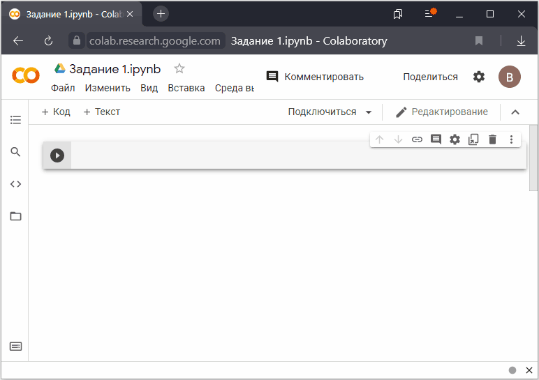

## Знакомство с Google Colaboratory

### Как дать всем доступ к тетрадке по ссылке

Когда вы копируете ссылку на тетрадку, то Google, по умолчанию, предоставляет ограниченный доступ к ней. То есть, для доступа:

1. У человека обязательно должен быть Google-аккаунт;
2. Вы должны разрешить этому аккаунту доступ.

В противном случае переход по ссылке приведёт на страницу с предложением запросить доступ у хозяина файла.

В ряде случаев нужно разрешить доступ к файлу всем у кого есть ссылка, без необходимости давать каждому отдельное разрешение.

Вот как это сделать

### Ссылки

1. [Учебник по Google Colab](https://ru.it-brain.online/tutorial/google_colab/your_first_colab_notebook/);

