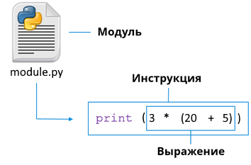

## Структура программы на языке Python

Программы на интерпретируемых языках, в том числе и на Python, называется скрипт. По своей сути программа - это специальным образом структурированный текст, а значит для чтения и редактирования кода достаточно обычного текстового редактора. Начиная с Python 3 интерпретатор ожидает, что код будет в формате [utf-8](https://ru.wikipedia.org/wiki/UTF-8) (при желании можно изменить). 

Скрипт состоит из последовательности инструкций, которые выполняются друг за другом, но существуют операторы позволяющие менять порядок выполнения инструкций. Каждая программа имеет хотя бы один поток выполнения кода, но если нужно их можно создать и больше.

Файл с программой на языке Python должен иметь расширение py и называется модулем.

<center></center>

При написании программ на Python принято придерживаться привил оформления исходного кода, которые перечислены в [PEP8](https://www.python.org/dev/peps/pep-0008/) (англ., ищите перевод в интернете).

### Комментарии

В программе кроме инструкций может присутствовать текст, который игнорируется интерпретатором - комментарии. Существуют однострочные и многострочные комментарии.

Для однострочного комментария зарезервирован символ `#`, который должен стоять в начале комментария. Начать однострочный комментарий можно где угодно, но при этом, все символы до конца строки будут считаться комментарием. В качестве однострочных комментариев, также можно использовать любой строковой литерал, т.е. текст заключённый в одинарные (`'`), двойные (`"`), тройные одинарные (`'''`), тройные двойные (`"""`) кавычки, но при написании такого комментария нужно придерживаться того же уровня отступов, что и в самом коде.

Для многострочных комментариев в Python нет специального синтаксиса, но мы по прежнему можем использовать любой строковой литерал. В случае использования одинарных версий кавычек `'` или `"` в конце каждой строки нужно добавлять обратный слеш (`\`), в случае тройных версий `'''` или `"""` ничего добавлять не нужно. Начало комментария должно быть на том же уровне отступов, что и код.

Основные назначения комментариев:

- Пояснение к коду. Не используйте обычные комментарии для описания того, что делает код, это и так уже описано в самом коде. Пишите почему код написан именно так, если вы использовали что-то не стандартное.

  ```Python
  # Блочный однострочный комментарий
  a = 3  # Встроенный однострочный комментарий
  ```
  
- Отключение части кода. Бывает нужно, чтобы какая-то часть кода перестала выполняться, но полностью удалять его не хочется, в таком случае его можно превратить в комментарий, просто окружив кавычками.

  ```python
  '''a = 3
  a = a + 1'''
  a = 5
  a = a - 1
  print(a)
  ```

- Создание встроенной в код документации. Согласно PEP8 для документирования кода используются строковые литералы заключённые в тройные двойные кавычки. Такие комментарии могут описывать:  что делает функция, возвращаемое ей значений, назначение параметров, предназначение класса или модуля и т.д.

  ```python
  """Справка по встроенной функции print из модуля builtins:
  
  print(...)
      print(value, ..., sep=' ', end='\n', file=sys.stdout, flush=False)
      
      Выводит значения в поток или по умолчанию в sys.stdout.
      Необязательные аргументы:
      file:  файлоподобный объект (поток); по умолчанию sys.stdout.
      sep:   строка вставляемая между значениями, по умолчанию пробел.
      end:   строка добавляемая после последнего значения, по умолчанию переводом строки.
      flush: следует ли принудительно сбрасывать поток.
  """
  ```

  В последствии, данный комментарий будет выводится в терминал при помощи функции `help`. 

### Справка

В Python принято документировать свой код, поэтому получить быструю помощь можно почти по всему, что есть в языке, для этих целей существует функция `help`. Данную функцию можно вызвать несколькими способами:

```python
help('if')   # Со строковым аргументом
help(print)  # Передав в качестве аргумента любой объект,
help(2)      # абсолютно любой
help()       # Без параметров
```

Вызов функции без параметров переведёт интерпретатор в интерактивный режим, после чего любой ввод будет воспринят как запрос к справочной системе. Выйти из справки можно нажав <kbd>Ctrl</kbd>+<kbd>C</kbd> или вводом `q` или `quit`.
