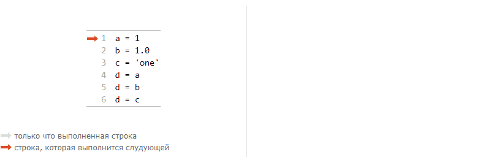

## Переменные и типы данных языка Python

### Переменные

Переменные предназначены для хранения информации с целью последующего её использования в другом месте программного кода. В Python переменная состоит из двух элементов: имени и ссылки на объект, при этом сам объект может создаваться вместе с переменной или уже существовать в памяти.

В следующем фрагменте кода создаётся переменная с именем `a`, в памяти создаётся объект `3` и между ними устанавливается связь:

```python
a = 3
```

- Имена – это записи в системной таблице. В этой же таблице предусмотрено место для хранения ссылок на объекты.
- Объекты – это области памяти с объемом, достаточным для представления значений этих объектов. Каждый объект имеет два стандартных поля: описатель типа, используемый для хранения информации о типе объекта, и счетчик ссылок, используемый для определения момента, когда память, занимаемая объектом, может быть освобождена.
- Ссылки – это связь имени с объектом.


У уже созданной переменной можно изменить ссылку выполнив повторное присваивание. При этом первый объект останется "висеть" в памяти как мусор. Через некоторое время мусорные объекты удаляются сборщиком мусора ([garbage collector](https://habr.com/ru/post/417215/)). Есть объекты, которые сборщик мусора не удаляет с целью оптимизации выполнения кода, но на данном этапе знакомства с Python это для нас не важно.

```python
a = 3
a = 7
```


После создания, переменную можно использовать в любом месте программы, при этом она будет давать доступ к объекту на который ссылается в данный момент:

```python
a = 3
print(a) # 3
a = 7
print(b) # 7
```

Попытка использования не созданной (объявленной) переменной приведёт к ошибке:

```python
print(a)
# NameError: name 'a' is not defined
```

### Типы данных

В Python 3 существует большое количество встроенных типов данных. 

Зачем данным нужен тип?

- Тип данных определяет занимаемый размер и способ представления данных в памяти. В большинстве случаев, память компьютера - это набор ячеек, каждая из которые может принимать одно из двух возможных значений: 0 или 1. Например последовательность бит `01000000` может означать целое число 64, символ ASCII таблицы @ или что-нибудь другое. Без указания типа данных точно узнать не получится.
- Тип данных определяет множество допустимых значений. Например: вещественные числа (тип float) в Python ограничены сверху значением max=1.7976931348623157⋅10<sup>308</sup>. Это означает, что сохранить в переменную типа float значение 1.8⋅10<sup>308</sup> уже не получится. При попытке прочитать данные из переменной вы получите inf, т.е. бесконечность.
- Тип данных определяет набор допустимых операций и правила работы операторов. Например: если применить к двум целым числам 4 и 5 оператор `+`, то в результате мы получим новое целое число, равное их сумме, т.е. 9. Если применить тот же оператор к двум строкам '4' и '5', то в результатом будет новая строка: '45'. При этом оператор `-` прекрасно работает с целыми числами, но вообще не применим к строкам.

Типы данных принято делить на два вида: встроенные и определённые пользователем. На начальном этапе обучения создавать свои типы не потребуется, т.к. стандартная библиотека Python уже включает самые часто применяемые типы данных.

Зачем нужны встроенные типы данных?

- Встроенные объекты упрощают создание программ. Так как избавляют от необходимости реализации собственных структур данных.
- Встроенные объекты часто более эффективны, чем аналогичные, но созданные вручную. Встроенные типы языка Python используют уже оптимизированные структуры данных, реализованные на языке C для достижения высокой производительности.
- Встроенные объекты являются стандартными составляющими языка Python и по этому они хорошо документированы и известны всем разработчикам. Это позволяет легко читать чужой или, давно забытый, свой код.
- Интерфейс встроенных типов практически всегда остаётся неизменными, тогда как собственные структуры имеют свойство изменяться от случая к случаю.

Мы рассмотрим следующие встроенные типы данных:

- Числа: `1382, 3.14, 3+4j, Decimal, Fraction`
- Строки: `'net', "your's", '''радость'''`
- Списки: `[1, [2, 'three'], 4]`
- Словари: `{'Alex': 2, 'Brian': 4}`
- Кортежи: `('Leo', 21.7, 'single')`
- Множества: `set(1,2,3), {'a', 'b', 'c'}`
- Файлы: `open('myfile', 'r')`
- NoneType: `None`

Для определения типа объекта, с которым в данный момент связана переменная, используется функция `type`:

```python
a = 3
print(type(a))
# <class 'int'>
```

Разные типы данных могут быть преобразованы друг в друга.

### Динамическая типизация

Во многих языках программирования, ***при создании*** переменной требуется указать тип данных, который будет в ней хранится, при этом, пока переменная существует, её тип НЕ может быть изменён. Такие языки называются ***статически типизированными***. 

Python - ***динамически типизированный*** язык. Это значит, что создавая переменную её тип указывать не нужно, т.к. каждый раз в процессе присваивания тип переменной будет определятся заново и он может многократно изменяться ***в процессе выполнения*** программы.

На следующем рисунке переменная `d` меняет тип хранимой информации в процессе выполнения программы с `int` на `float`, затем на  `str`:

[](http://www.pythontutor.com/visualize.html#code=a%20%3D%201%0Ab%20%3D%201.0%0Ac%20%3D%20'one'%0Ad%20%3D%20a%0Ad%20%3D%20b%0Ad%20%3D%20c&cumulative=true&curInstr=6&heapPrimitives=true&mode=display&origin=opt-frontend.js&py=3&rawInputLstJSON=%5B%5D&textReferences=false)